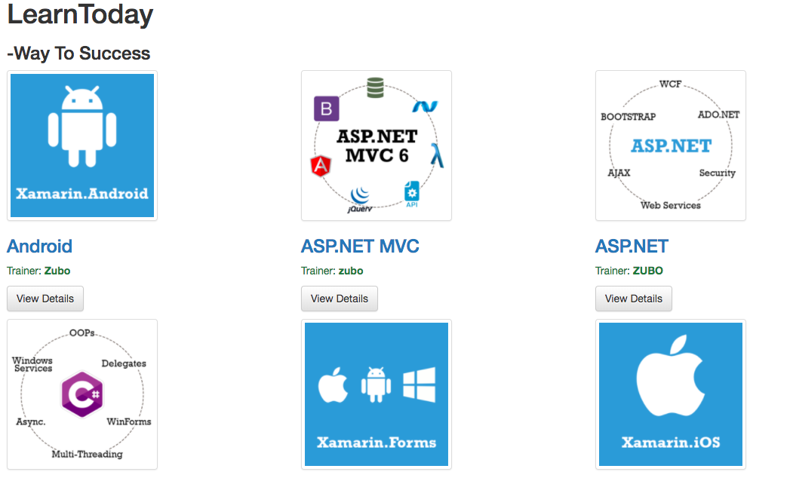
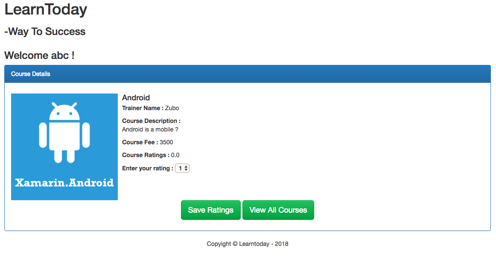

# LearnToday
Build web application with register, login, view, search and rating courses functions by using Java Server Pages(JSP), JDBC, MySQL(Database), Tomcat(Web Container)





## LearnToday Project Notes (How to run the web application)
Use bootstrap CDN(content delivery network) for the application.

### Create Data for course in MySQL.
Use mysql workbench to create Table
```
CREATE TABLE `mydb`.`course` (
  `CourseID` INT(11) NOT NULL AUTO_INCREMENT,
  `CourseTitle` VARCHAR(45) NOT NULL,
  `Trainer` VARCHAR(45) NOT NULL,
  `ImageUrl` VARCHAR(45) NULL DEFAULT NULL,
  `Fees` INT(11) NULL DEFAULT NULL,
  `CourseDescription` VARCHAR(450) NULL DEFAULT NULL,
  PRIMARY KEY (`CourseID`),
  UNIQUE INDEX `CourseTitle_UNIQUE` (`CourseTitle` ASC))
ENGINE = InnoDB
DEFAULT CHARACTER SET = utf8;
```

Insert Data to Table course
```
INSERT INTO `mydb`.`course` (`CourseID`, `CourseTitle`, `Trainer`, `ImageUrl`, `Fees`, `CourseDescription`) VALUES ('1', 'Android', 'Zubo', './images/android.png', '3500', 'Android is a mobile …');
INSERT INTO `mydb`.`course` (`CourseID`, `CourseTitle`, `Trainer`, `ImageUrl`, `Fees`, `CourseDescription`) VALUES ('2', 'ASP.NET MVC', 'zubo', './images/aspmvc.png', '3499', 'ASP.NET MVC is …');
INSERT INTO `mydb`.`course` (`CourseID`, `CourseTitle`, `Trainer`, `ImageUrl`, `Fees`, `CourseDescription`) VALUES ('3', 'ASP.NET', 'ZUBO', './images/aspnet.png', '3000', 'ASP.NET is ..');
INSERT INTO `mydb`.`course` (`CourseID`, `CourseTitle`, `Trainer`, `ImageUrl`, `Fees`, `CourseDescription`) VALUES ('4', 'C#.NET', 'ZUBO', './images/csharp.png', '3000', 'C# is ..');
INSERT INTO `mydb`.`course` (`CourseID`, `CourseTitle`, `Trainer`, `ImageUrl`, `Fees`, `CourseDescription`) VALUES ('5', 'Xamarin.Forms', 'Zubo	', './images/forms.png', '9999', 'Xamarin,Forms is ..');
INSERT INTO `mydb`.`course` (`CourseID`, `CourseTitle`, `Trainer`, `ImageUrl`, `Fees`, `CourseDescription`) VALUES ('6', 'Xamarin.IOS', 'zubo', './images/ios.png', '12999', 'Xamarin.IOS is ..');
INSERT INTO `mydb`.`course` (`CourseID`, `CourseTitle`, `Trainer`, `ImageUrl`, `Fees`, `CourseDescription`) VALUES ('7', 'JDBC', 'ZUBO', './images/jdbc.png', '8999', 'JDBC is ..');
INSERT INTO `mydb`.`course` (`CourseID`, `CourseTitle`, `Trainer`, `ImageUrl`, `Fees`, `CourseDescription`)VALUES ('8', 'JSP', 'Zubo', './images/jsp.png', '9999', 'JavaServer Pages(JSP) is a …');
INSERT INTO `mydb`.`course` (`CourseID`, `CourseTitle`, `Trainer`, `ImageUrl`, `Fees`, `CourseDescription`) VALUES ('9', 'Xamarin.Android', 'zubo', './images/xamarin.png', '19999', 'Xamarin,Android is ..');
```
Query Table
```
SELECT * FROM mydb.course;
```

### Rating Table Data
```
CREATE TABLE `mydb`.`Ratings` (
  `RatingID` INT(11) NOT NULL AUTO_INCREMENT,
  `CourseTitle` VARCHAR(45) NULL DEFAULT NULL,
  `UserName` VARCHAR(45) NULL DEFAULT NULL,
  `Rating` INT(11) NULL DEFAULT NULL,
  PRIMARY KEY (`RatingID`))
ENGINE = InnoDB
DEFAULT CHARACTER SET = utf8;
```

### MySQL for mac notes
Update Path and change root user password
```
cat ~/.bash_profile 
echo 'export PATH="/usr/local/mysql/bin:$PATH"' >> ~/.bash_profile
mysql -u root -p
ALTER USER 'root'@'localhost' IDENTIFIED WITH mysql_native_password BY 'test';
ALTER USER 'root'@'localhost' IDENTIFIED BY 'root';
\q
CREATE DATABASE mydb
```

Create a new schema 'mydb' which is user to connect to DB. Create `users` table which as `username` and `password` columns.

Then we can use JDBC to register new user and Authenticate existing users.
```
CREATE TABLE mydb.users (usrname VARCHAR(20), password VARCHAR(20));
select * from users;
```

### Deploy war file
> cd LearnToday

> mvn clean install

> cp target/LearnToday.war ~/apache-tomcat-9.0.5/webapps/

Copy LearnToday.war file into Tomcat /webapps directory.

Go to browser and view the page.

> http://localhost:8080/LearnToday

Add the url path in JSP Page

> http://localhost:8080/LearnToday/index.jsp

### Maven Archetype to initial a project
```mvn -DarchetypeGroupId=org.codehaus.mojo.archetypes -DarchetypeArtifactId=webapp-javaee7 -DarchetypeVersion=1.1 -DgroupId=com.LearnToday -DartifactId=LearnToday -Dversion=1.0 -Darchetype.interactive=false --batch-mode -Dpackage=com.learntoday archetype:generate```
